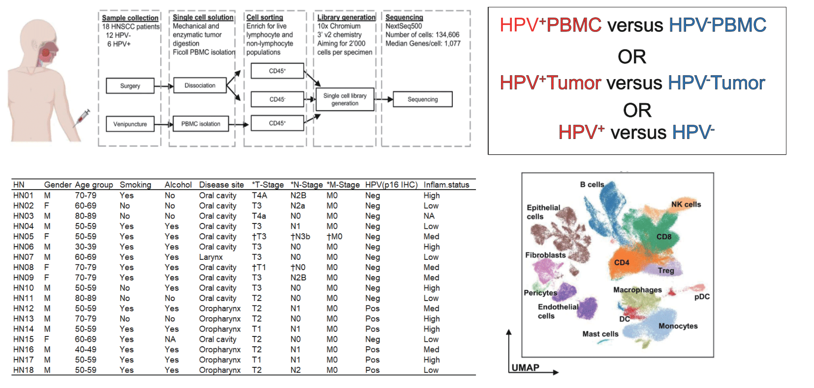
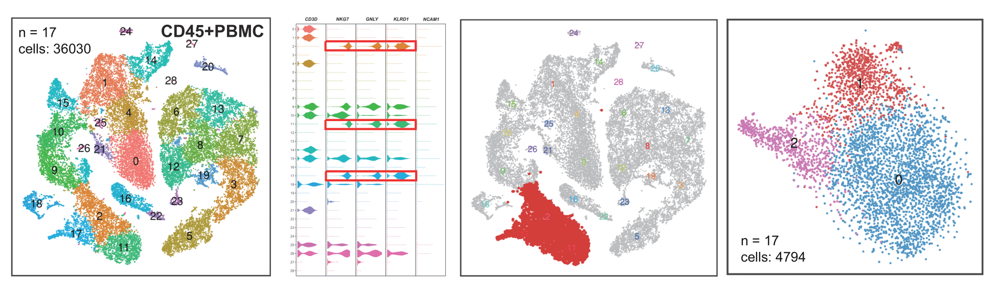
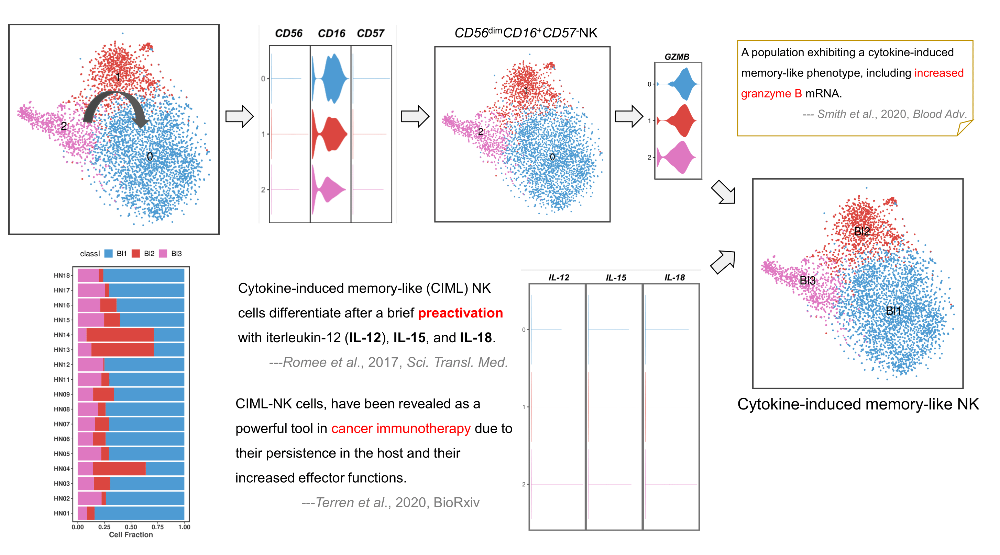
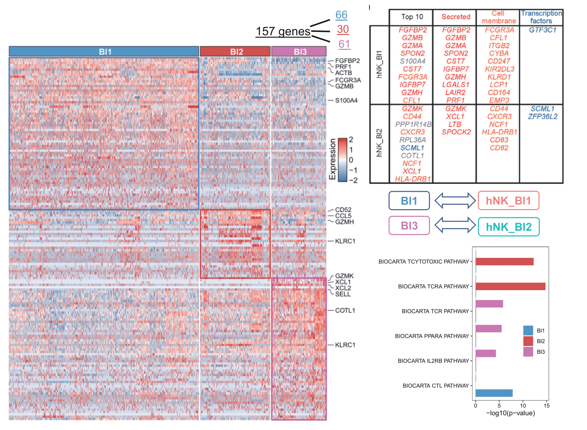
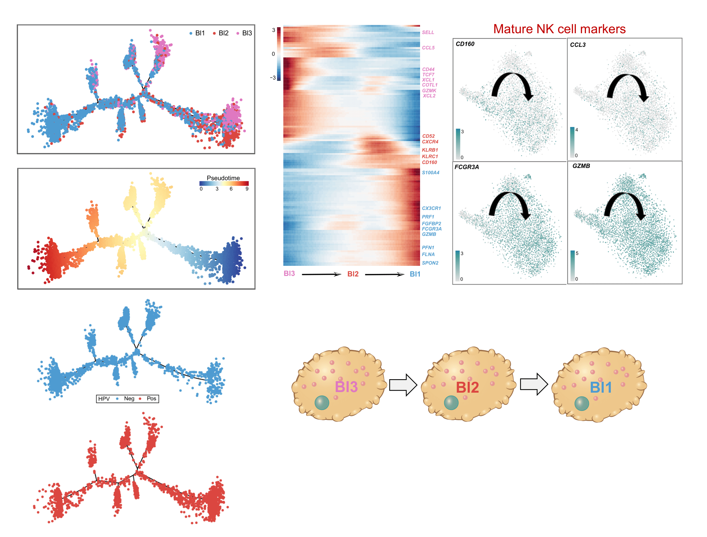
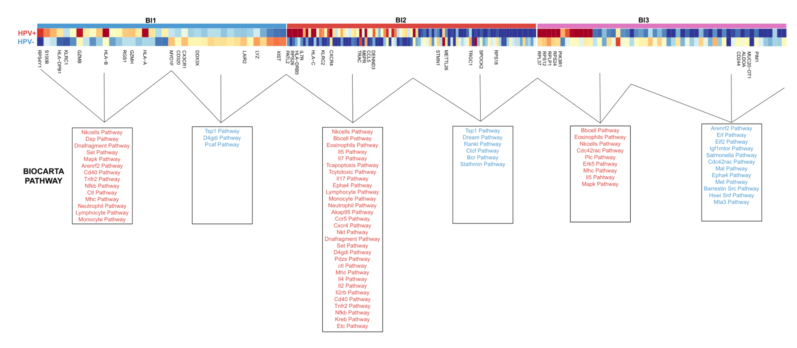
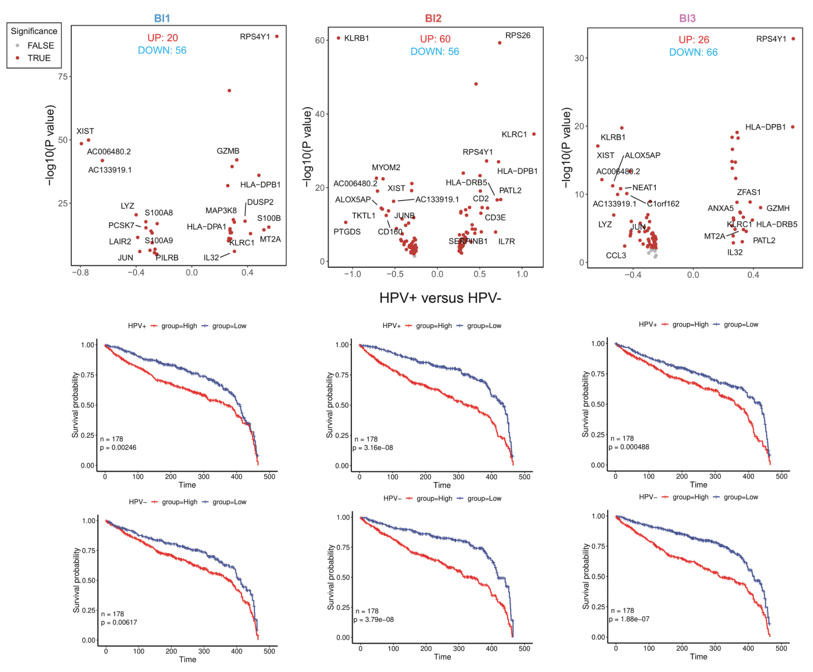

#### Novel cytokine-induced memory-like (CIML) NK cells were associated with circulating immune microenvironment

Pipeline for scRNA-seq data analysis of HNSCC data obtained from [GSE164690](https://www.ncbi.nlm.nih.gov/geo/query/acc.cgi?acc=GSE164690)

------------------

##### Figure 1. Clinical information for data

##### Figure 2. NK cell extraction

##### Figure 3. Cytokine-induced memory-like NK

##### Figure 4. NK subsets support different biological functions

##### Figure 5. Trajectories of NK cell differentiation in blood

##### Figure 6. The DEA between HPV+ and HPV- NK subsets

##### Figure 7. Evaluation of prognosis outcomes of NK subsets between HPV+ and HPV- HNSCC patients

